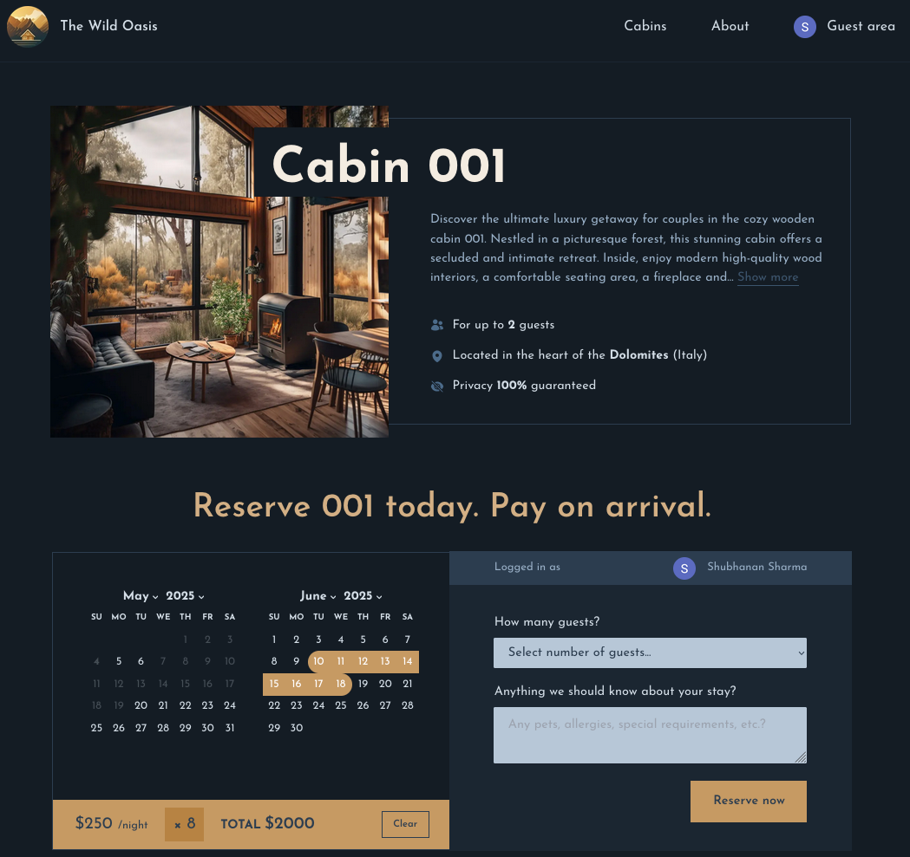

# The Wild Oasis

A luxurious cabin booking platform for a resort located in the heart of the Italian Dolomites. Built with Next.js, React, and Tailwind CSS.



## Overview

The Wild Oasis is a full-featured cabin booking application that allows users to:

- Browse available cabins
- Filter cabins by capacity
- View detailed cabin information
- Check availability using a calendar interface
- Make reservations
- Manage their bookings in a guest area
- Authenticate using Google Sign-In

## Tech Stack

- **Framework**: [Next.js](https://nextjs.org/)
- **Authentication**: [NextAuth.js](https://next-auth.js.org/) with Google provider
- **Database**: [Supabase](https://supabase.io/)
- **Styling**: [Tailwind CSS](https://tailwindcss.com/)
- **UI Components**:
  - [React Day Picker](https://react-day-picker.js.org/) for date selection
  - [Heroicons](https://heroicons.com/) for icons
- **Date Manipulation**: [date-fns](https://date-fns.org/)
- **Fonts**: Google Fonts (Josefin Sans)

## Project Structure

```
app/
├── _components/       # Reusable UI components
├── _lib/             # Utility functions and API services
├── _styles/          # Global styles
├── about/            # About page
├── account/          # User account pages
├── api/              # API routes
├── cabins/           # Cabin listing and detail pages
├── login/            # Authentication page
├── layout.js         # Root layout
├── page.js           # Homepage
```

## Data Flow

1. Data is fetched from Supabase using server-side data fetching
2. User authentication is handled through NextAuth.js with Google provider
3. Bookings are created through server actions
4. Optimistic UI updates are used for a smooth UX during booking operations

## Features

### Cabin Browsing

- Filter cabins by capacity (small, medium, large)
- Detailed cabin pages with descriptions and images
- Pricing information with discount display

### Booking System

- Interactive date picker with unavailable dates disabled
- Guest count selection
- Optional notes/observations field
- Pricing calculation based on selected dates

### User Account

- Google authentication
- View upcoming and past reservations
- Edit or cancel upcoming reservations

## Getting Started

### Prerequisites

- Node.js (v14 or later)
- npm or yarn

### Installation

1. Clone the repository

```bash
git clone https://github.com/shubhs27/The-wild-oasis-website.git
cd the-wild-oasis
```

2. Install dependencies

```bash
npm install
# or
yarn install
```

3. Set up environment variables
   Create a `.env.local` file in the root directory with the following variables:

```
# Authentication
AUTH_GOOGLE_ID=your_google_client_id
AUTH_GOOGLE_SECRET=your_google_client_secret
NEXTAUTH_SECRET=your_nextauth_secret
NEXTAUTH_URL=http://localhost:3000

# Supabase
NEXT_PUBLIC_SUPABASE_URL=your_supabase_url
NEXT_PUBLIC_SUPABASE_ANON_KEY=your_supabase_anon_key
```

4. Run the development server

```bash
npm run dev
# or
yarn dev
```

5. Open [http://localhost:3000](http://localhost:3000) in your browser

## Database Schema

### Tables

- `cabins` - Cabin information (name, capacity, price, image, etc.)
- `guests` - User account information
- `bookings` - Reservation details
- `settings` - Application settings like min/max booking length

## Authentication Flow

1. User clicks "Guest area" or attempts to make a reservation
2. Redirected to login page with Google Sign-In option
3. After successful authentication:
   - If first-time user, a new guest record is created
   - User is redirected back to previous page

## Responsive Design

The application is designed to work on various screen sizes, with responsive layouts for:

- Cabin cards (grid system)
- Navigation
- Reservation interface

## Future Enhancements

- Payment integration
- Additional authentication providers
- Admin dashboard for cabin management
- Reviews and ratings system
- Multiple location support

## Acknowledgments

- This project is part of Jonas Schmedtmann's Udemy course - The Ultimate React Course 2025
- All assets and UI components are inspired by the course material.
